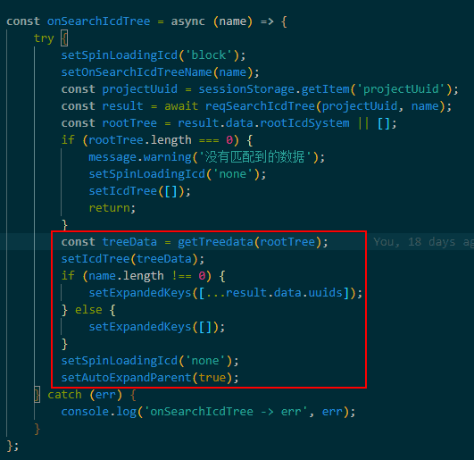

# Tree Antd4

## 1.Tree 的属性中设置了受控 expendedKeys,

-   一定要在内部设置 onExpand 这个函数，来指定展开的 key 值，同时设置 autoExpandedParent 的属性值为 false
-   如果 autoExpandedParent 的值为 true，当子元素展开的时候，点击父元素不能合上

## 2.treeData 的优先级

-   一定要最先更新 treeData 的值，否则后边的对树的操作都不会生效
    
