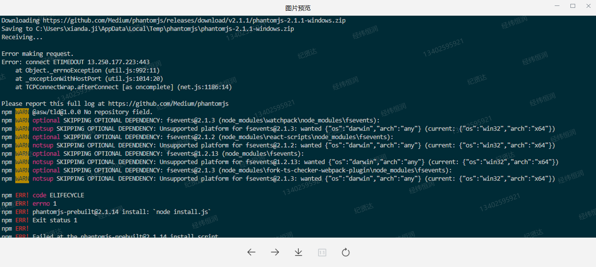
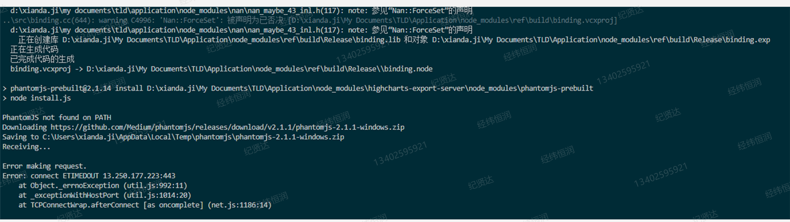
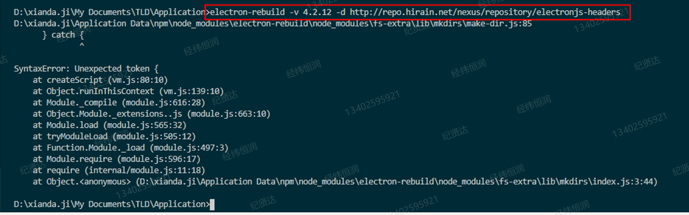
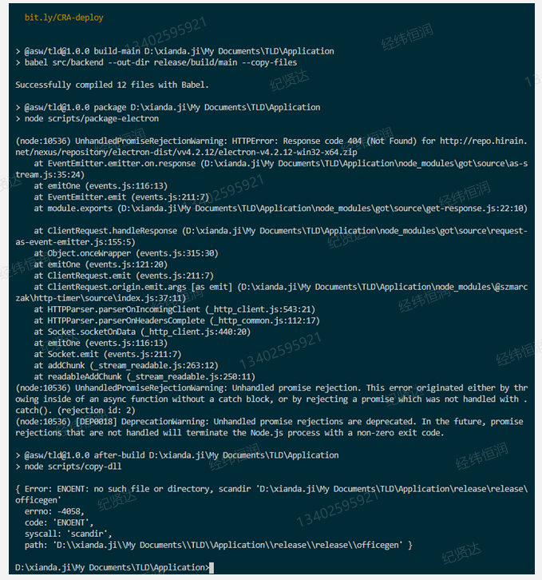

# electron 环境配置(内网) 4.2.12 版本

## 1.node-gyp 的配置

-   添加环境变量之后需要重启终端
-   如果还报错，在终端进行配置，npm config set XXX = "XXX"

## 2.electron 的版本问题

-   有的版本自带 v 有的则不带 v(4.2.12),环境变量值中要配置好

## 3. 发布 release

-   在 release 中要安装一遍依赖
-   npm 配置 electron 的镜像要写对，与环境变量区分开，注意没有等号
-   发布第一次不报错，第二次报错，说占用进程等,关闭 vscode，再重新打开，或者不用 vscode 打包

```
node:17036) UnhandledPromiseRejectionWarning: Error: EBUSY: resource busy or locked, rmdir

```

## 4.启动程序

-   1.要在项目所在的目录打开 vscode，不要嵌套文件夹，直接暴露 lanch.json
-   2.全局安装 electron-rebuild，electron-packager

## 5.环境配置以及启动调试代码常见报错

-   1.phantomjs 报错 原因：内网安装问题，手动导入包
    
    
-   2.rebuild 报错 :重装 electron-rebuild ,或者 electron 的版本不对
    
-   3.镜像 v 相关，多写了一个 v，但是有的版本的确需要添加 v，这个依照版本决定
    
