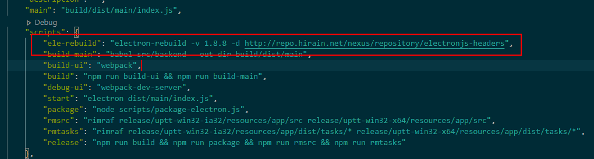

# 调试问题

## 1.点击 vscode 的 debug 按钮

-   出现 electron 的页面，但是内容是空白，原因没起前端项目，electron 配置默认起 3000 端口
-   内容是其他项目

## 2.发布之后新增了文件

-   是否上传到 gitlab 上，已经设置了 gitignore

## 3.electron 的工程在哪里调试？

-   热加载
-   调试工具 electron 里有设置，shift+chtrl+i
-   主进程调试：vscode->launch.json->runtimeExcutable

## 4.78 项目中用到的 ffi 和 ref 的方法

-   使用高版本的 electron 引入 ffi 和 ref 的方法使用：ref-napi，ffi-napi?78 项目使用的 electron 的版本是 4.X，也要这样引入？ `dllService.js`

原因：

## 5. TLD 分析

-   未覆盖故障率系数错误->dll 卡死->只能强关，有其他优化措施吗？

## 6. 渲染层调试：ctrl+shift+i

## 7.无人机项目中的问题

-   登录密码

    在后端密码比较那一行打断点查看

-   起后端项目
    
    原因：elecrtron 没有 rebuild
    
-   点击导入数据，出现 electron 停止工作
    
