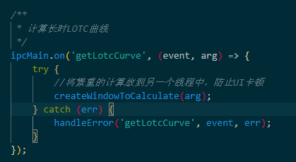
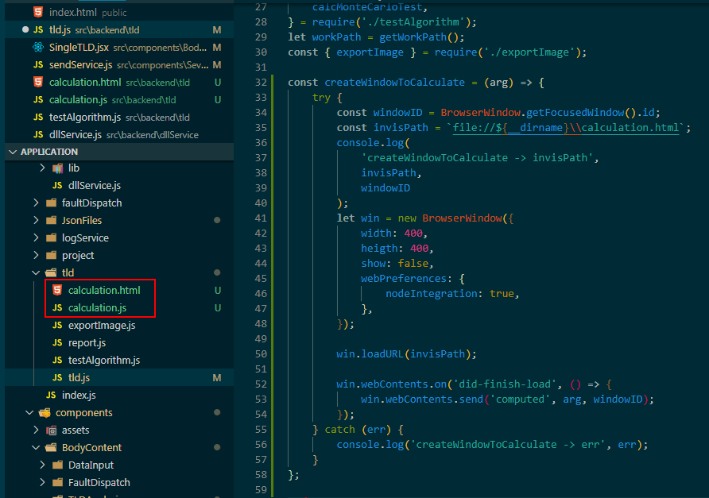
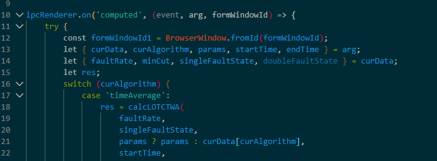
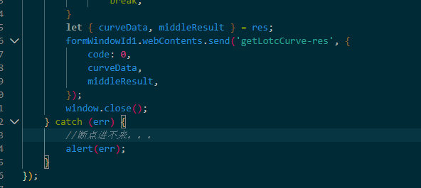

# Electron UI 卡顿

## 1.导致卡顿的原因：参考 https://zhuanlan.zhihu.com/p/37050595

在 chromium 中，页面渲染时，UI 进程需要和 main process 不断的进行 sync IPC，若此时 main process 忙，则 UI process 就会在 IPC 时阻塞。

## 2.解决办法：

-   electron 再打开一个窗口，script 内通过 remote 来调用主进程的方法，执行大量的计算：`问题`：不能打开新建窗口的调试工具，目前通过 alter 查看，之前代码不运行是因为拼写单词拼写错误。。。。。。。。
-   web worker：方案与第一种类似，依然需要调用 remote 方法，而且 web worker 在前端，还要调用后端的代码，导致前后端混乱
-   知乎推荐：Tray+web worker ——> 对于 Tray 不太了解
-   使用 http 协议

