# G6 总结以及 Bug

## 1.自定义边

-   自定义一个边有两个 label

    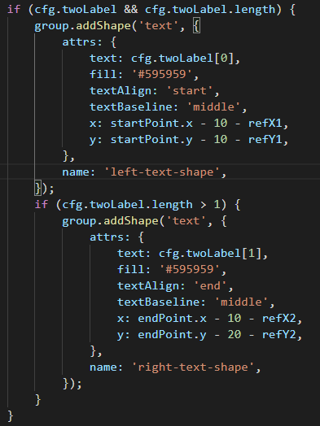

-   边的两端有圆圈

    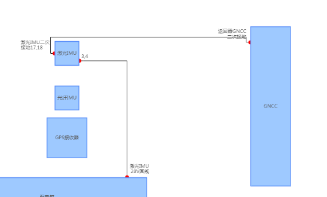

    代码实现

    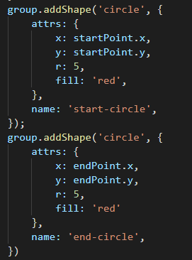

-   过长的 label 怎么换行
    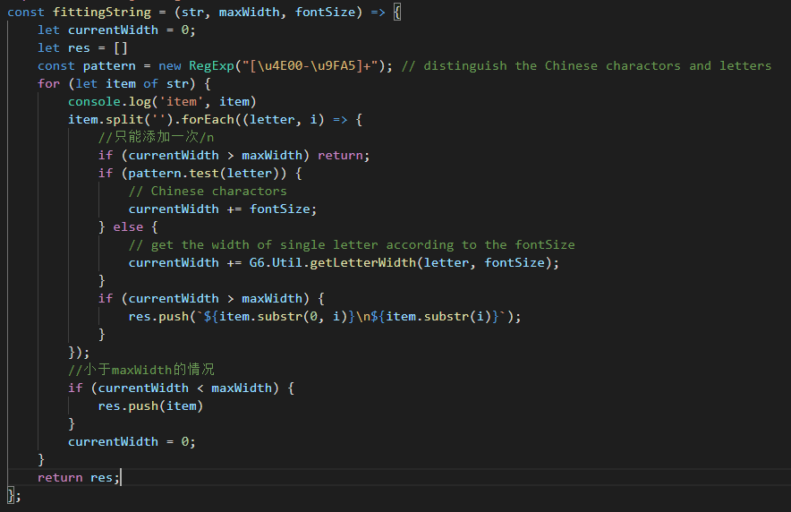
    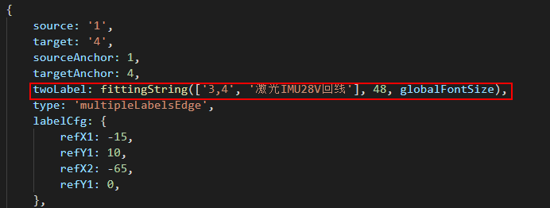
-   出现划痕
    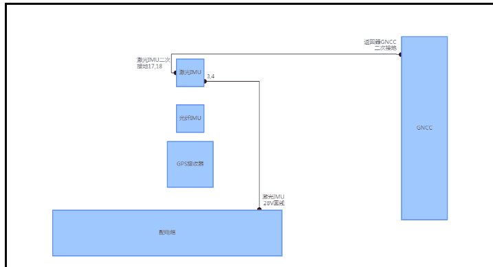

    -   可能原因：超出画布的边界，或者其他
    -   解决办法：添加属性 `fitCenter:true` 将元素都放在画布中间或者增加高度和宽度

-   shape 会减少

    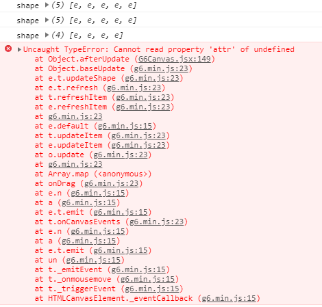

    -   原因：只画了一个边，另一个边画导致更新顺序错乱

        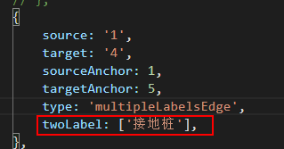

    -   解决办法：将第二条边也画上，即使不需要任何文字

        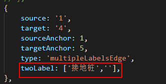

-   afterUpdate()

    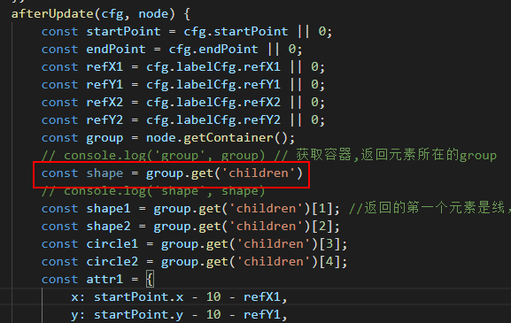

    group.get('children')的顺序是 draw()和 afterDraw()画的顺序。

-   lineAppendWidth 的位置要写在定义的边内，写在 defaultEdge 内无效
    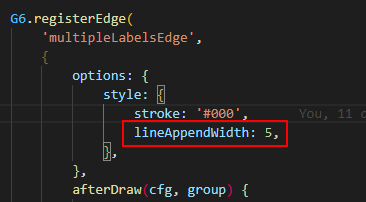
    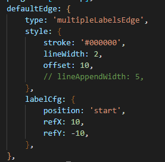

-   **自定义节点的注册，渲染数据函数在 componentDidmount 中实现，并且注册节点函数在数据渲染函数之前**

## 2.Bug

-   can't read property '0' of null

    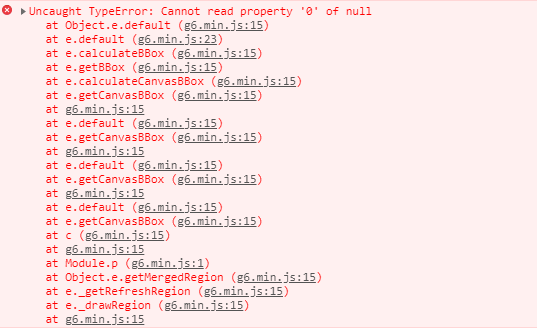

    解决办法：定义节点时候要有 x,y 属性，即使都为负数，在全局中设置了布局之后，会忽视之前定义的 x，y

    但是：依然有错误

-   加 rect 加不上

    

原因：没设置宽度和高度

## 3.自定义节点

-   graph.data(data) 与 注册节点 afterDraw()的顺序
    graph.data(data)在 afterDraw()之前
    

## 4.现存问题

-   拖拽报错(一直未解决)使用内置边与节点都报错
-   label 重叠(middle)
-   多个连接器在同侧需要后端配合(后续提供数据结构)

## 5.changeData()报错，改为 graph.paint()


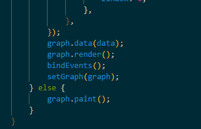

但是 paint 只能更新当前 id 相同的节点边等，更新数据源不会重绘
报错原因是数据源出现的问题，线的 target 指向了不存在节点

## 6.在给连接器添加点击事件的时候，出现不能相应的情况，但是 demo 中却可以实现

```js
group.addShape('circle', {
    attrs: {
        x: 0,
        y: -30,
        r: 10,
        fill: '#096dd9',
        cursor: 'pointer',
    },
    name: 'circle-shape',
});

graph.on('circle-shape:click', (evt) => {
    const { item } = evt;
    graph.updateItem(item, {
        label: '点击了圆',
        labelCfg: {
            style: {
                fill: '#003a8c',
                fontSize: 16,
            },
        },
    });
});
```

可能与版本有关？使用版本：3.5.8 ，当前文档版本：3.8.0

解决办法：

手动添加判断：拿到点击对象 e.getTarget()
