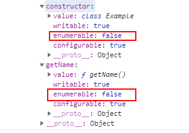

# class 容易遗忘的点

## 1.constructor 函数：构造方法

new 之后，默认执行 constructor(),里边的 this 指向实例

实例属性的新写法

```js
class Example {
    // x = 1;
    // string = 'string'; 会报错

    getName() {
        return 'Example';
    }
}
const example = new Example();
console.log('example', example);
```

## 2.原型上的方法都是不可枚举的

```js
class Example {
    constructor() {
        this.x = 1;
        this.string = 'string';
    }
    getName() {
        return 'Example';
    }
}

const example = new Example();
// const example1 = JSON.stringify(example)  //原型链不会出现在json中
for (let key in example) {
    console.log('key', key); //原型上的方法是不可枚举的   Object.getOwnPropertyDescriptors(obj)查看是否可枚举
}
```

Object.getOwnPropertyDescriptors() 方法打印的结果



## 3.静态属性/方法

```js
class Bind {
    constructor() {
        this.str = 'hello';
    }
    sayHello() {
        console.log(this.str);
    }
}

const sayHello = Bind.sayHello; //获取不到，因为不是静态方法
```

下面这样写可以获取

```js
class Bind {
    constructor() {
        this.str = 'hello';
    }
    static sayHello() {
        console.log(this.str);
    }
}

const sayHello = Bind.sayHello; //可以获取
```

## 4.关于 this 指向

```js
class Bind {
    constructor() {
        this.str = 'hello';
    }
    sayHello() {
        console.log('打印', this);
    }
}

const bindInst = new Bind();
const { sayHello } = bindInst;
sayHello(); //打印 undefined
```

上边代码打印的 this 是 undefined，原因是：将这个方法提取出来单独使用，this 会指向该方法运行时所在的环境（由于 class 内部是严格模式，所以 this 实际指向的是 undefined）。

```js
class Bind {
    constructor() {
        this.str = 'hello';
        this.sayHello = this.sayHello.bind(this); //将sayHello中的this绑定为实例，类似于(实例).(调用bind的方法)，那么方法内的this就指向了调用它的实例了
    }
    sayHello() {
        console.log('打印', this);
    }
}

const bindInst = new Bind();
const { sayHello } = bindInst;
sayHello(); //打印的this是bindInst
```

-   疑问；为什么要写成`this.sayHello = this.sayHello.bind(this)`这种形式，写成`this.sayHello.bind(this)`不也是绑定了吗？
    原因：`this.sayHello = this.sayHello.bind(this)`这种写法会创建实例方法，而这个方法是改变过 this 指向的，
    而`this.sayHello.bind(this)`这种写法的确也是改变了 this 指向，但是当我们再次从实例中取方法时，这个 sayHello 依然是从原型链中拿，单独使用的话，原型链中方法的依然没有绑定 this
-   同名方法或属性，有限实例属性，之后去原型链找
