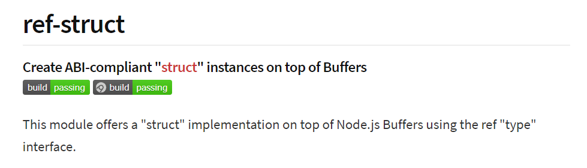
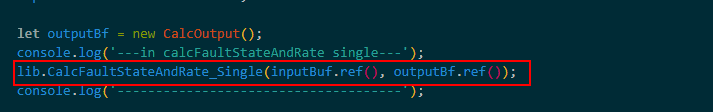

# dll 动态链接库在 electron /node 中怎么使用

## 1.ffi

-   使用 ffi 调用动态链接库
-   在 main.js 中添加如下代码:

```js
const ffi = require('ffi-napi');
/**
 * 先定义一个函数, 用来在窗口中显示字符
 * @param {String} text
 * @return {*} none
 */
function showText(text) {
    return new Buffer(text, 'ucs2').toString('binary');
}
// 通过ffi加载user32.dll
const myUser32 = new ffi.Library('user32', {
    // 声明这个dll中的一个函数
    MessageBoxW: [
        'int32',
        ['int32', 'string', 'string', 'int32'], // 用json的格式罗列其返回类型和参数类型
    ],
});

// 调用user32.dll中的MessageBoxW()函数, 弹出一个对话框
const isOk = myUser32.MessageBoxW(
    0,
    showText('I am Node.JS!'),
    showText('Hello, World!'),
    1
);
console.log(isOk);
```

这段代码中, 主要调用了 windows 的 user32.dll, 具体的步骤都写在了代码的注释中.

-   项目中的 ffi 使用方法
    

## 2.Ref



-   定义结构体

```js
var ref = require('ref');
var StructType = require('ref-struct');

// define the time types
var time_t = ref.types.long;
var suseconds_t = ref.types.long;

// define the "timeval" struct type
var timeval = StructType({
    tv_sec: time_t,
    tv_usec: suseconds_t,
});

// now we can create instances of it
var tv = new timeval();
```

-   使用

```js
var ffi = require('ffi');

var tv = new timeval();
gettimeofday(tv.ref(), null);
```

tv.ref()会转成 c 语言

-   项目中用法

    将参数传入到动态链接库中
    
