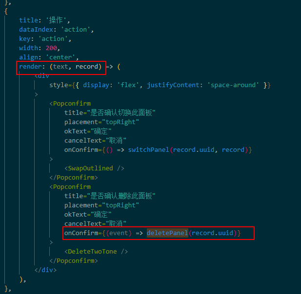
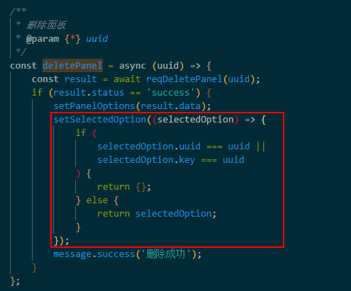

# HOOK

Hook 在 class 内部是不起作用的。

Hook 使用了 JavaScript 的闭包机制，而不用在 JavaScript 已经提供了解决方案的情况下，还引入特定的 React API。

## 1.函数组件的写法

```js
const Example = (props) => {
    // 你可以在这使用 Hook
    return <div />;
};
```

或是这样：

```js
function Example(props) {
    // 你可以在这使用 Hook
    return <div />;
}
```

## 2.声明 State 变量

-   优点

    -   在函数组件中，我们没有 this，所以我们不能分配或读取 this.state。我们直接在组件中调用 useState Hook：

    -   如果你的更新函数返回值与当前 state 完全相同，则随后的重渲染会被完全跳过。

-   与 setState 的比较：

    -   useState 不会自动合并更新对象，setState 可以结合展开运算符来达到合并更新对象的效果

```js
import React, { useState } from 'react';

function Example() {
  // 声明一个叫 “count” 的 state 变量
  const [count, setCount] = useState(0); //数组解构的写法
```

-   useState 方法的时候做了什么

    它与 class 里面的 this.state 提供的功能完全相同。一般来说，在函数退出后变量就会”消失”，而 state 中的变量会被 React 保留。

-   useState 需要哪些参数

    useState() 方法里面唯一的参数就是初始 state。

    如果我们想要在 state 中存储两个不同的变量，只需调用 useState() 两次即可。

-   useState 方法的返回值是什么

    当前 state 以及更新 state (this.setState)的函数

-   读取 State(直接用)

    在函数中，我们可以直接用 count:2

    ```html
    <p>You clicked {count} times</p>
    ```

-   更新 State

    在函数中，我们已经有了 setCount 和 count 变量，所以我们不需要 this:

    ```html
    <button onClick={() => setCount(count + 1)}>
    Click me
    </button>
    ```

-   使用多个 state 变量

    ```js
    function ExampleWithManyStates() {
    // 声明多个 state 变量
    const [age, setAge] = useState(42);
    const [fruit, setFruit] = useState('banana');
    const [todos, setTodos] = useState([{ text: '学习 Hook' }]);
    ```

    **你不必使用多个 state 变量。State 变量可以很好地存储对象和数组，因此，你仍然可以将相关数据分为一组。然而，不像 class 中的 this.setState，更新 state 变量总是替换它而不是合并它。**

## 3.使用 Effect Hook

Effect Hook 可以让你在函数组件中执行副作用操作

数据获取，设置订阅以及手动更改 React 组件中的 DOM 都属于副作用。不管你知不知道这些操作，或是“副作用”这个名字，应该都在组件中使用过它们。

把 useEffect Hook 看做 componentDidMount，componentDidUpdate 和 componentWillUnmount 这三个函数的组合。

```js
import React, { useState, useEffect } from 'react';

function Example() {
    const [count, setCount] = useState(0);

    // Similar to componentDidMount and componentDidUpdate:
    useEffect(() => {
        // Update the document title using the browser API
        document.title = `You clicked ${count} times`;
    });

    return (
        <div>
            <p>You clicked {count} times</p>
            <button onClick={() => setCount(count + 1)}>Click me</button>
        </div>
    );
}
```

-   优点

    -   `React 保证了每次运行 effect 的同时，DOM 都已经更新完毕,不用再去考虑“挂载”还是“更新”`

    *   **传递给 useEffect 的函数在每次渲染中都会有所不同，这是刻意为之的。事实上这正是我们可以在 effect 中获取最新的 count 的值，而不用担心其过期的原因。**

    *   与 componentDidMount 或 componentDidUpdate 不同，使用 useEffect 调度的 effect 不会阻塞浏览器更新屏幕，这让你的应用看起来响应更快。大多数情况下，effect 不需要同步地执行。**useEffect 会在浏览器绘制后延迟执行，但会保证在任何新的渲染前执行。React 将在组件更新前刷新上一轮渲染的 effect。**

*   为什么在 React class 中，我们把副作用操作放到 componentDidMount 和 componentDidUpdate 函数中?
    在 React 的 class 组件中，render 函数是不应该有任何副作用的。一般来说，在这里执行操作太早了，我们基本上都希望在 React 更新 DOM 之后才执行我们的操作。

*   两种常见副作用操作：需要清除的和不需要清除的

    -   无需清除的 effect: 发送网络请求，手动变更 DOM，记录日志
    -   需要清楚的：订阅外部数据源

*   useEffect 做了什么

    -   告诉 React 组件需要在渲染后执行某些操作
    -   执行 DOM 更新之后调用它

*   为什么在组件内部调用 useEffect

    -   将 useEffect 放在组件内部让我们可以在 effect 中直接访问 count state 变量（或其他 props）

*   useEffect 会在每次渲染后都执行吗？
    -   是的，默认情况下，它在第一次渲染之后和每次更新之后都会执行。
    -   React 保证了每次运行 effect 的同时，DOM 都已经更新完毕。

-   需要清除的 effect：由于添加和删除订阅的代码的紧密性，所以 useEffect 的设计是在同一个地方执行。如果你的 effect 返回一个函数，React 将会在执行清除操作时调用它

```js
useEffect(() => {
    function handleStatusChange(status) {
        setIsOnline(status.isOnline);
    }
    ChatAPI.subscribeToFriendStatus(props.friend.id, handleStatusChange);
    // Specify how to clean up after this effect:
    return function cleanup() {
        ChatAPI.unsubscribeFromFriendStatus(
            props.friend.id,
            handleStatusChange
        );
    };
});
```

-   React 何时清除 effect

    React 会在组件卸载的时候执行清除操作

    如之前学到的，effect 在每次渲染的时候都会执行。这就是为什么 React 会在执行当前 effect 之前对上一个 effect 进行清除。

**并不是必须为 effect 中返回的函数命名。也可以返回一个箭头函数或者给起一个别的名字。**

-   使用多个 Effect 实现关注点分离

    ```js
    function FriendStatusWithCounter(props) {
        const [count, setCount] = useState(0);
        useEffect(() => {
            document.title = `You clicked ${count} times`;
        });

        const [isOnline, setIsOnline] = useState(null);
        useEffect(() => {
            function handleStatusChange(status) {
                setIsOnline(status.isOnline);
            }

            ChatAPI.subscribeToFriendStatus(
                props.friend.id,
                handleStatusChange
            );
            return () => {
                ChatAPI.unsubscribeFromFriendStatus(
                    props.friend.id,
                    handleStatusChange
                );
            };
        });
        // ...
    }
    ```

Hook 允许我们按照代码的用途分离他们， 而不是像生命周期函数那样。React 将按照 effect `声明的顺序` 依次调用组件中的每一个 effect。

## 4.HOOK 规则

-   只在最顶层使用 Hook
-   不要在循环，条件或嵌套函数中调用 Hook
-   只在 React 函数中调用 Hook
-   不要在普通的 JavaScript 函数中调用 Hook。

那么 React 怎么知道哪个 state 对应哪个 useState？答案是 React 靠的是 Hook 调用的顺序。

## 5.API

-   useLayoutEffect: 因为 effect 可以被延迟执行，使用 useLayoutEffect 来实现与 DOM 同步执行

## 6.Hook 与高阶函数

高阶函数

```js
function Count({ count, add, minus }) {
    return (
        <View
            style={{ flex: 1, alignItems: 'center', justifyContent: 'center' }}
        >
            <Text>You clicked {count} times</Text>
            <Button onPress={add} title={'add'} />
            <Button onPress={minus} title={'minus'} />
            <Button onPress={changeTheme} title={'ChangeTheme'} />
        </View>
    );
}

const countNumber = (initNumber) => (WrappedComponent) =>
    class CountNumber extends React.Component {
        state = { count: initNumber };

        add = () => this.setState({ count: this.state.count + 1 });

        minus = () => this.setState({ count: this.state.count - 1 });

        render() {
            return (
                <WrappedComponent
                    {...this.props}
                    count={this.state.count}
                    add={this.add.bind(this)}
                    minus={this.minus.bind(this)}
                />
            );
        }
    };

export default countNumber(0)(Count);
```

hook

```js
export default function HookCount() {
    const [count,addCount,minusCount] = countNumber(0);
    return (
        <View style={{backgroundColor:theme,flex:1,alignItems:'center',justifyContent:'center'}}>
            <Text>You clicked {count} times</Text>
            <Button onPress={addCount} title={'add'}/>
            <Button onPress={minusCount} title={'minus'}/>
            <Button onPress={changeTheme} title={'ChangeTheme'}/>
        </View>
    );
}

function countNumber(initNumber) {
    const [count, setCount] = useState(initNumber);
    const addCount=()=> setCount(count + 1);
    const minusCount=()=>setCount(count -1);
    return [
        count,
        addCount,
        minusCount
    ]
```

## 7.使用 hooks 更新状态，注意引用类型不更新(地址没变)

解决：扩展运算符,复制原引用类型，再添加

```js
{...obj,name:'rrr'}
[...array,item]
```

可以直接改变引用类型的值，不需要视图更新不用 hooks？

## 8.set 函数取不到值


原因，不同的 tablecell，在 onFocus 中没有执行 onSelect 函数

## 9. set 函数更新顺序->tree 的渲染

setTreeData 放到下边两个 set 函数中间就不行，可能与组件逻辑有关


## 10. useRef()

-   于普通的 createRef 的区别：一个函数组件，每执行一次都会重新创建变量，这样 createRef 就会重复创建。而 useRef 是存储在外部的，如果监测到 dom 没有变化，就不会重新创建
-   useRef 创建的 ref 并不会随着组件的更新而重新构建
-   于这个特性，在使用 react-hook 的时候，可以使用 useRef 来存储常量。

## 11.使用 useCallback()来存放回调函数

## 12 .深入理解 React useLayoutEffect 和 useEffect 的执行时机

https://blog.csdn.net/yunfeihe233/article/details/106616674/

-   useEffect(create, deps):

该 Hook 接收一个包含命令式、且可能有副作用代码的函数。在函数组件主体内（这里指在 React 渲染阶段）改变 DOM、添加订阅、设置定时器、记录日志以及执行其他包含副作用的操作都是不被允许的，因为这可能会产生莫名其妙的 bug 并破坏 UI 的一致性。使用 useEffect 完成副作用操作。赋值给 useEffect 的函数**会在组件渲染到屏幕之后执行**。你可以把 effect 看作从 React 的纯函数式世界通往命令式世界的逃生通道。

副作用包括：函数组件主体内（这里指在 React 渲染阶段）改变 DOM、添加订阅、设置定时器、记录日志以及执行其他包含副作用的操作都是不被允许的，

-   useLayoutEffect(create, deps):

其函数签名与 useEffect 相同，但它会在**所有的 DOM 变更之后同步调用 effect**。可以使用它来读取 DOM 布局并同步触发重渲染。在浏览器执行绘制之前，useLayoutEffect 内部的更新计划将被同步刷新。

-   useEffect 和 useLayoutEffect 的区别？

useEffect 在渲染时是异步执行，并且要等到浏览器将所有变化渲染到屏幕后才会被执行。

useLayoutEffect 在渲染时是同步执行，其执行时机与 componentDidMount，componentDidUpdate 一致

-   对于 useEffect 和 useLayoutEffect 哪一个与 componentDidMount，componentDidUpdate 的是等价的？

useLayoutEffect，因为从源码中调用的位置来看，useLayoutEffect 的 create 函数的调用位置、时机都和 componentDidMount，componentDidUpdate 一致，且都是被 React 同步调用，都会阻塞浏览器渲染。

-   useEffect 和 useLayoutEffect 哪一个与 componentWillUnmount 的是等价的？

同上，useLayoutEffect 的 detroy 函数的调用位置、时机与 componentWillUnmount 一致，且都是同步调用。useEffect 的 detroy 函数从调用时机上来看，更像是 componentDidUnmount (注意 React 中并没有这个生命周期函数)。

-   为什么建议将修改 DOM 的操作里放到 useLayoutEffect 里，而不是 useEffect？

可以看到在流程 9/10 期间，DOM 已经被修改，但但浏览器渲染线程依旧处于被阻塞阶段，所以还没有发生回流、重绘过程。由于内存中的 DOM 已经被修改，通过 useLayoutEffect 可以拿到最新的 DOM 节点，并且在此时对 DOM 进行样式上的修改，假设修改了元素的 height，这些修改会在步骤 11 和 react 做出的更改一起被一次性渲染到屏幕上，依旧只有一次回流、重绘的代价。

如果放在 useEffect 里，useEffect 的函数会在组件渲染到屏幕之后执行，此时对 DOM 进行修改，会触发浏览器再次进行回流、重绘，增加了性能上的损耗。

## 问题

1. hooks 的更新机制：合并成对象？

2. 自定义 hooks：实现复用逻辑

    - 在两个组件中使用相同的 Hook 会共享 state 吗？不会。自定义 Hook 是一种重用状态逻辑的机制(例如设置为订阅并存储当前值)，所以每次使用自定义 Hook 时，其中的所有 state 和副作用都是完全隔离的。

3. 多个业务逻辑使用多个 useEffect.
4. useRef 的使用

    - 问题: let sss = useRef(null) 出现创建两次 ref 再对 sss 赋值
    - 解决：const sss = useRef(null) sss.current=XXX 。使用 current 来进行对值的存储

5. 获取到的 state 值不是最新的:
    - 原因：闭包
    - 解决办法：使用函数方式获取最新的值
      
      
