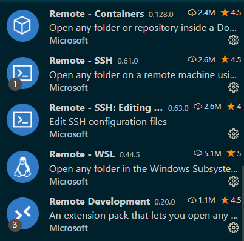
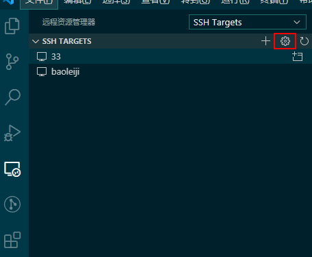
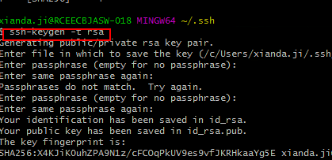
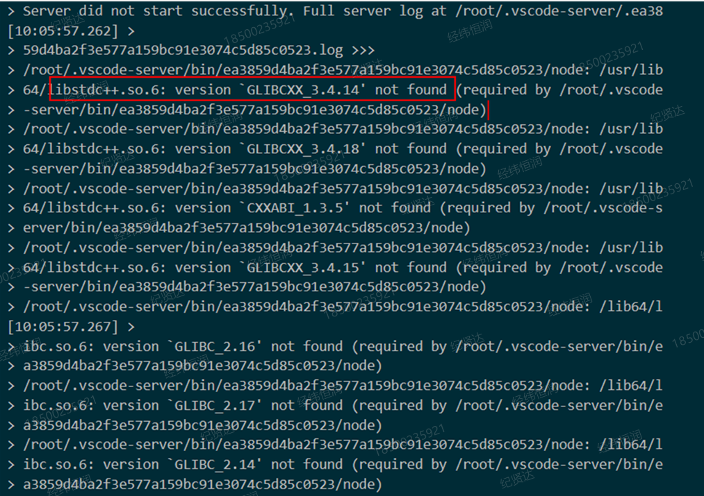

# vscode remote

使用 vscode 的 remote development 插件，可以对在服务器上的程序进行远程调试

-   1.下载插件 remote development
-   2.配置 ssh/config

    

-   3.查看本机 ssh 公钥，生成指令 `ssh-keygen -t rsa`.
    

-   4.将公钥追加到服务器的/root/.ssh/authorized_keys 文件中
    authorized_keys 如果没有，可以自己新建

-   5.首次建立连接，目的是产生/root/.vscode-server 文件
-   6.根据.vscode-server 文件夹中的 id 名(一大长串)来下载压缩包(如果没有网络的话,本机联网的情况下请忽略这一步，会自动下载好)

    https://update.code.visualstudio.com/commit:17299e413d5590b14ab0340ea477cdd86ff13daf/server-linux-x64/stable

-   7.卡在了服务器系统版本

    

-   8.服务器版本正常的情况下，点击连接，即可正常访问。

    
