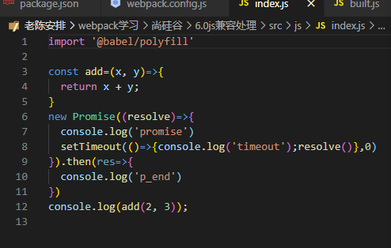
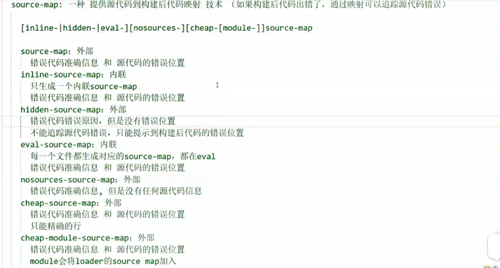
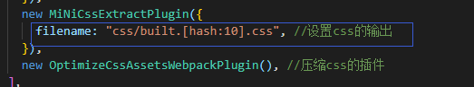
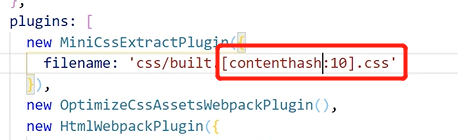
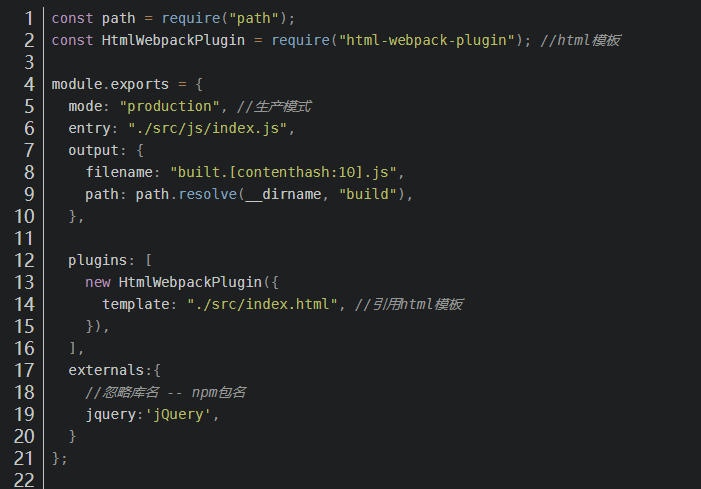

# webpack

https://blog.csdn.net/mus123/article/details/107711168

-   入口
-   输出
-   module:
    -   css
    -   less
    -   js 兼容
    -   js 语法
    -   css 兼容
    -   css 压缩
    -   图片处理
    -   外部文件
-   plugin
    -   html
-   模式:production/development
-   dev-server

## 1. css 兼容性处理

```js
{
        test: /\.css$/,
        use: [
          // "style-loader",//代替style-loader不使用标签插入
          MiniCssExtractPlugin.loader,
          //css兼容性处理：postcss-loader postcss-preset-env
          "css-loader",
          // 'postcss-loader',//不能使用默认配置,帮postcss找到package.json中的browserslist（自己配置）
          // 而且browserslist默认是生产环境，要
          // "browserslist":{
          //设置node环境变量，process.env.NODE_ENV='development'
          //   "development":[
          //     "last 1 chrome version",
          //     "last 1 firefox version",
          //     "last 1 safari version"
          //   ],
          //生产环境:默认是生产环境
          //   "production":[
          //     ">0.01%",
          //     "not dead",
          //     "not op_mini all"
          //   ]
          // }
          {
            loader:'postcss-loader',
            options:{
              ident:'postcss',
              plugins:()=>[
                require("postcss-preset-env")()
              ]
            }
          }
        ],
      },
```

## 2.css 压缩:optimize-css-assets-webpack-plugin

直接用

```js
plugins: [
    new HtmlWebpackPlugin({
      template: "./src/index.html",
    }),
    new MiniCssExtractPlugin({
      filename:'css/built.css'
    }),
    new OptimizeCssAssetsWebpackPlugin(),
  ],
```

## 3.js 语法检查(先于 babel 执行,enforce:'pre')

```js
module:{
        rules:[
            {
                //语法检查：对js进行规范，检查语法错误，eslint-loader eslint
                //只检查源代码，不检查第三方
                //设置检查规则 package.json中的eslintConfig中设置（airbnb）
                // "eslintConfig":{
                //     "extends":"airbnb-base"
                //   }
                //eslint-config-airbnb-base(五react) eslint eslint-plugin-import
                test:/\.js$/,
                exclude:/node_modules/, //一定要排除第三方的检查
                loader:'eslint-loader',
                enforce:'pre' //优先执行
                options:{
                     fix:true,//自动修复
                },
            }
        ]
    }
```

设置检查规则 package.json 中的 eslintConfig 中设置（airbnb）eslint-config-airbnb(-base)

```json
"eslintConfig":{
    "extends":"airbnb-base"
}
```

## 4.js 的兼容性配置

```js
 module:{
        rules:[
            {
                //下载babel-loader和@babel/preset-env @babel/core
                loader:'babel-loader',
                test:/\.js$/,
                exclude:/node_modules/,
                options:{
                    //预设：指示babel做什么样的兼容性处理
                    presets:['@babel/preset-env']
                }
            }
        ]
    },
```

注：暂时只能转换基本语法，比如箭头函数是可以的，但是 promise 他又不认识了

因此要进行进一步兼容

使用@babel/polyfill 引入所有的兼容语法


但是体积过大

所以推荐按需加载的方式 core-js，删除之前引入的 polyfill

```js
 module:{
        rules:[
            {
                //下载babel-loader和@babel/preset-env @babel/core
                //暂时只能转换一部分简单语法
                //使用@babel/polyfill，但是特别大
                //最终选择按需加载的方式 core-js
                loader:'babel-loader',
                test:/\.js$/,
                exclude:/node_modules/,
                options:{
                    //预设：指示babel做什么样的兼容性处理
                    //presets:['@babel/preset-env']
                    presets:[
                        [
                            '@babel/preset-env',{
                                useBuiltIns:'usage',//按需加载
                                corejs:{
                                    version:3,//制定core-js版本
                                },
                                targets:{
                                    chrome:"60",
                                    firefox:'60',
                                    ie:'9',
                                    safari:'10',
                                    edge:'17',
                                }
                            }
                        ]
                    ]
                }
            }
        ]
    },
```

## 5.js 压缩

mode:'production'

## 6.html 压缩(不需要做 html 兼容性处理)

```js
plugins: [
    //该插件的主要功能是将打包之后的文件通过script绑到html上
    new HtmlWebpackPlugin({
      template: "./src/index.html",//可以是模板引擎ejs等
      //压缩
      minify:{
        //移除空格
        collapseWhitespace:true,
        //移除注释
        removeComments:true,
      }
    }),
  ],
```

---

# webpack 优化配置

-   开发环境
-   生产环境

## 开发环境

-   优化打包构建速度

    -   问题:只修改一个模块,但是其他模块也同样被打包,影响打包速度
    -   解决:HMR 功能

    ```js
    devServer: {
      contentBase: path.resolve(__dirname, 'build'),
      compress: true,
      port: 3001,
      // 开启HRM热模块替换
      hot: true,
    },
    ```

    -   **HRM 热模块**替换：只会打包某一个模块而不是所有都重新打包

        -   样式文件在使用 style-loader 的情况下可以使用 HRM

        -   js 文件默认不使用 HRM，需要自动刷新：需要修改 js 文件实现热加载

        ```js
        if (module.hot) {
            //可以监听print.js的代码变化启动HRM，但是对入口文件index.js不能起到作用
            module.hot.accept('./print.js', () => {
                console.log('热加载print.');
                //console.log(module.hot);
                print();
            });
        }
        ```

        -   html 不能随之热加载，也不会自动刷新（修改 entry 入口，改成数组引入 html），spa 不做 HRM(因为只有一个 html 文件) `entry: ['./src/js/index.js', './src/index.html'],`

-   优化代码调试

    -   source-map:一种提供源代码与构建之后代码的映射技术

        -   `devtool:'source-map'`
        -   有七种:

            -   source-map：会生成 built.js.map 的一个映射文件

            -   inline-source-map：内联，映射文件的代码会内嵌在构建后的 built.js 的末尾

            -   hidden-source-map：会生成外部的 built.js.map，但是在浏览器的 source 中会隐藏 webpack://，不隐藏构建后代码

            -   eval-source-map：也是内联的 source-map，但是都会追加在 built.js 的每个模块引入的 eval 中

            -   nosources-source-map：生成在外部，但是在浏览器的 source 中会隐藏我们的 js 源代码（有路径），构建后的 js 代码也看不见

            -   cheap-source-map：生成在外部，和 source-map 类似但是错误提示到整行而不是整句，会受到 babel 的影响

            -   cheap-module-source-map：生成在外部，和 source-map 类似但是错误提示到整行而不是整句，不会收到 babel 的影响

        -   

## 生产环境

-   优化打包构建速度
    -   问题:每个文件都会过一遍配置的 loader,但是一个文件只能使用一个 loader
    -   解决:oneOf:[...] ,将 eslint loader 写在外边,与 oneOf 同级
    -   问题:有 100 个 js 模块,只改了 1 个文件,那么其他 99 个文件也得重新构建一次
    -   解决:缓存
        -   babel 缓存
            
        -   文件资源缓存(只有资源名称改变的时候才不会缓存)
        -   输出文件加上 hash:但是如果重新打包,会导致所有缓存失败(只改了一个文件)
        -   解决办法:chunkhash:根据 chunk 生成的 hash.如果打包来源于同一个 chunk,那么 hash 值就一样:但是由于 css 与 js 同属一个 chunk
        -   解决办法:contenthash:根据文件内容生成 hash.不同文件的 hash 值一定不一样
            
            
            
-   优化代码运行性能
    -   Tree shaking 树摇（去除没有使用的代码
        -   基本上生产环境下使用 es6 模块引用会自动使用
        -   Tree shaking 是为了去除无用的 js 或者 css 代码，减少代码体积
        -   js：必须使用 es6 模块化，使用 production 环境
    -   代码分割
        -   多入口:输出文件[name]入口文件叫什么,输出文件就叫什么,但是这种编写方式不灵活

```js
module.exports = {
    mode: 'production', //生产模式
    // entry: "./src/js/index.js",//单入口
    entry: {
        //多入口，每个入口一个bundle
        main: './src/js/index.js',
        test: './src/js/test.js',
    },
    output: {
        filename: 'js/[name].[contenthash:10].js',
        path: path.resolve(__dirname, 'build'),
    },

    plugins: [
        new HtmlWebpackPlugin({
            template: './src/index.html', //引用html模板
            minify: {
                //压缩html
                collapseInlineTagWhitespace: true,
                removeComments: true,
            },
        }),
    ],
    devtool: 'source-map',
};
```

-   使用 splitChunks(多入口文件有没有共同的依赖)
    
-   单独打包文件

```js
//index.js

// import { mul } from './test';
const add = (x, y) => x + y;
new Promise((resolve) => {
  console.log('promise');
  setTimeout(() => {
    console.log('timeout');
    resolve();
  }, 0);
}).then(() => {
  console.log('p_end');
});
console.log(add(2, 3));
import('./test')//返回promisr对象
  .then((res)=>{
    console.log('test加载成功',res)
    console.log(res.mul(3, 3));
  })
  .catch((e)=>{
    console.log(e)
  }
```

自定义名称

```js
import(/* webpackChunkName:'test' */ './test') //返回promisr对象
    .then((res) => {
        console.log('test加载成功', res);
        console.log(res.mul(3, 3));
    })
    .catch((e) => {
        console.log(e);
    });
```

## 懒加载:利用 webpack 代码分割,将其放在异步操作里


## 预加载:正常加载是并行加载,同一时间加载多个文件.预加载是在浏览器空闲的时候偷偷加载(浏览器兼容性比较差)


区别:懒加载->当文件比较大,点击按钮可能会加载很长时间
预加载不会出现

## PWA:离线模式,可以使用部分功能

## 多进程打包(babel)

有利有弊:进程启动 600ms 进程通信也有开销
只有工作消耗时间比较长,才需要多进程
应该适用于大项目，使用 babel 转化比较多的时候

## externals 忽略打包 XXX:用途:使用标签(CDN)引入的资源

CDN

## dll 动态链接库,可以把第三方库分开打包,不用重复打包

## devServer 详细配置


