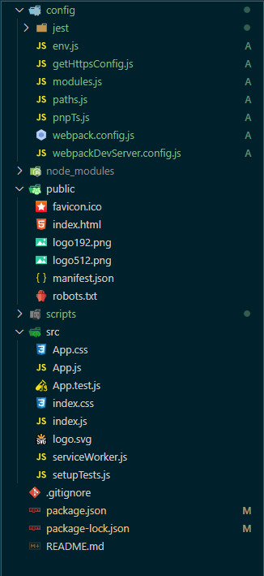
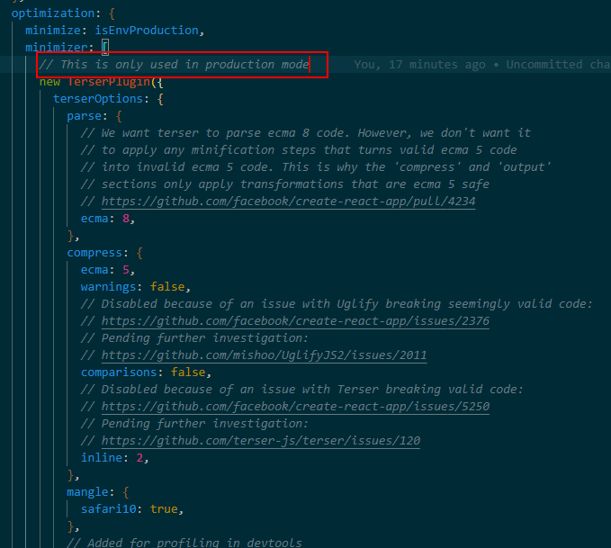

# 脚手架配置

参考文档：https://www.html.cn/create-react-app/

## 1.继承 create-react-app 脚手架，在其基础上进行完善

-   暴露配置

react 官方脚手架暴露配置之后的插件：



通过 package.json 中的信息可以大致看一下，官方脚手架将 webpack 中所依赖的模块已经配置好
缺少的依赖需要我们自己来手动添加，比如 antd，less，react-router 等

```json
{
"name": "my-app",
"version": "0.1.0",
"private": true,
"dependencies": {
  "@babel/core": "7.9.0",
  "@svgr/webpack": "4.3.3",
  "@testing-library/jest-dom": "^4.2.4",
  "@testing-library/react": "^9.5.0",
  "@testing-library/user-event": "^7.2.1",
  "@typescript-eslint/eslint-plugin": "^2.10.0",
  "@typescript-eslint/parser": "^2.10.0",
  "babel-eslint": "10.1.0",
  "babel-jest": "^24.9.0",
  "babel-loader": "8.1.0",
  "babel-plugin-named-asset-import": "^0.3.6",
  "babel-preset-react-app": "^9.1.2",
  "camelcase": "^5.3.1",
  "case-sensitive-paths-webpack-plugin": "2.3.0",
  "css-loader": "3.4.2",
  "dotenv": "8.2.0",
  "dotenv-expand": "5.1.0",
  "eslint": "^6.6.0",
  "eslint-config-react-app": "^5.2.1",
  "eslint-loader": "3.0.3",
  "eslint-plugin-flowtype": "4.6.0",
  "eslint-plugin-import": "2.20.1",
  "eslint-plugin-jsx-a11y": "6.2.3",
  "eslint-plugin-react": "7.19.0",
  "eslint-plugin-react-hooks": "^1.6.1",
  "file-loader": "4.3.0",
  "fs-extra": "^8.1.0",
  "html-webpack-plugin": "4.0.0-beta.11",
  "identity-obj-proxy": "3.0.0",
  "jest": "24.9.0",
  "jest-environment-jsdom-fourteen": "1.0.1",
  "jest-resolve": "24.9.0",
  "jest-watch-typeahead": "0.4.2",
  "mini-css-extract-plugin": "0.9.0",
  "optimize-css-assets-webpack-plugin": "5.0.3",
  "pnp-webpack-plugin": "1.6.4",
  "postcss-flexbugs-fixes": "4.1.0",
  "postcss-loader": "3.0.0",
  "postcss-normalize": "8.0.1",
  "postcss-preset-env": "6.7.0",
  "postcss-safe-parser": "4.0.1",
  "react": "^16.13.1",
  "react-app-polyfill": "^1.0.6",
  "react-dev-utils": "^10.2.1",
  "react-dom": "^16.13.1",
  "resolve": "1.15.0",
  "resolve-url-loader": "3.1.1",
  "sass-loader": "8.0.2",
  "semver": "6.3.0",
  "style-loader": "0.23.1",
  "terser-webpack-plugin": "2.3.8",
  "ts-pnp": "1.1.6",
  "url-loader": "2.3.0",
  "webpack": "4.42.0",
  "webpack-dev-server": "3.11.0",
  "webpack-manifest-plugin": "2.2.0",
  "workbox-webpack-plugin": "4.3.1"
},
```

## 2.需要添加项

-   1. 修改 webpack 默认配置，添加 less,修改 devserver 端口等：config-overrides.js
-   2. 代理配置：src/setupProxy.js(可选)

        

        参考文档：https://www.html.cn/create-react-app/docs/proxying-api-requests-in-development/

-   3. 加入 eslintrc,规范代码，create-react-app 已经添加，语法校验配置文档可能需要修改
-   4. 全局传参
       使用 React 提供的 Context:Context 提供了一个无需为每层组件手动添加 props，就能在组件树间进行数据传递的方法。

        context 的使用方法：https://react.docschina.org/docs/context.html

-   5. 路由：react—router
-   6. ajax 请求：axios 或者 fetch()->可选

        

        axios 博主推荐原因：https://mp.weixin.qq.com/s?__biz=Mzg5MDAzNzkwNA==&mid=2247484063&idx=1&sn=4d55ddaf448d3e3a4b8da9d0d751383c&chksm=cfe3f160f8947876c3daa731de9728aeb257db82055180bb13a53971ace38e6c11921f648f59&mpshare=1&scene=1&srcid=091814womKbYceO891eyNrlA&sharer_sharetime=1600657878914&sharer_shareid=ee2a7847446d9cb19667485c1672fb11#rd

        或者查看官方文档：http://www.axios-js.com/zh-cn/docs/

-   7. 使用 ts->可选
-   8. 单元测试方案：https://www.html.cn/create-react-app/docs/running-tests/
       使用 Jest 作为其测试运行器,旨在用于逻辑和组件的单元测试，而不是为了测试 DOM 一些奇怪的行为。

## 3.注意项

-   1. 压缩插件默认配置 Terser，使用 Uglify 插件似乎会有一些 bug,它不支持压缩 es6，在 webpack4.0 中已经去除

        ，

-   2. antd 的按需加载 webpack 已经支持

        

-   3. Moment.js 库进入维护状态，由于是比较旧的库，在项目中最好不要使用
       Antd 提出了替换方法：https://ant-design.gitee.io/docs/react/replace-moment-cn
       请注意 antd 的版本
-   4. 不支持修饰器，请不要使用修饰器语法

        

-   5. 不建议暴露配置修改:因为从那时起，你必须自己维护配置和脚本。在这种情况下，我们建议使用 fork react-scripts 和你需要的任何其他软件包，来代替 ejecting 。可以对暴露文件源码进行学习。

## 4.待议事项(可能会增加代码量，针对不同需求的项目来设置)

-   1 . 预渲染静态 HTML 文件

    

    官方 demo：https://github.com/geelen/create-react-app-snapshot

-   2.  文件夹结构：css/less 怎么放，image 放哪里，测试模块等
        参考:css 位置 https://www.html.cn/create-react-app/docs/adding-a-stylesheet/

        public 文件夹的使用 https://www.html.cn/create-react-app/docs/using-the-public-folder/

-   3. proxy 中间层->可选
-   4. webpack 打包速度，如果慢，加入其他插件
-   5. react 系列，webpack，antd 固定版本
-   6. 浏览器支持：chrome v77.x 及以上
