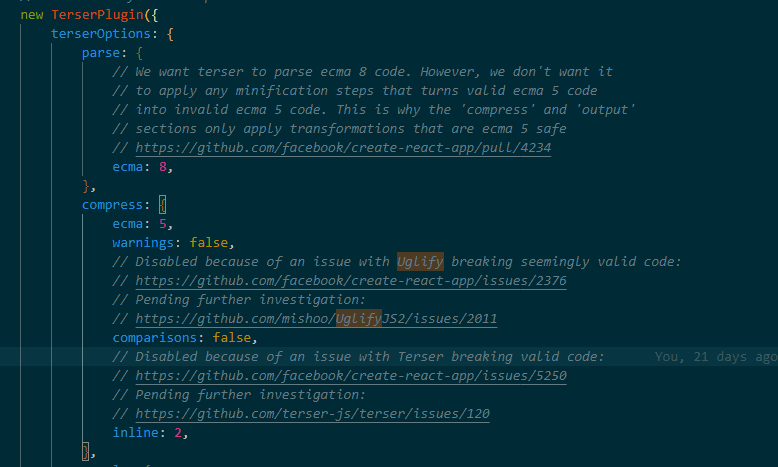

# 脚手架配置

参考文档：https://www.html.cn/create-react-app/docs/proxying-api-requests-in-development/

## 1.继承 create-react-app 脚手架，在其基础上进行完善，新加的模块如下：

-   1. 修改 webpack 默认配置，添加 less,修改 devserver 端口等：config-overrides.js
-   2. 代理配置：src/setupProxy.js
       
-   3. 加入 eslintrc,规范代码
-   4. 压缩插件默认配置 Terser，使用 Uglify 插件似乎会有一些 bug，
       
