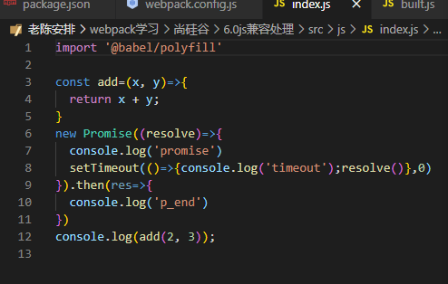
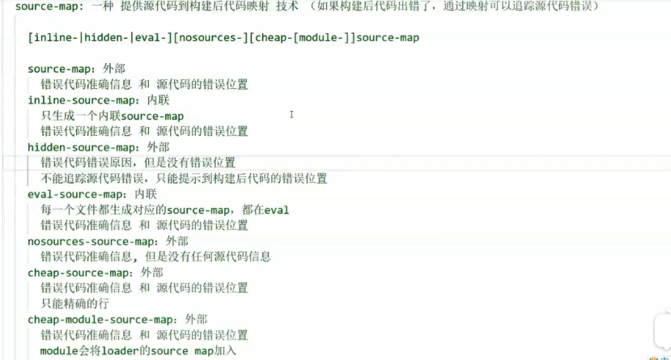
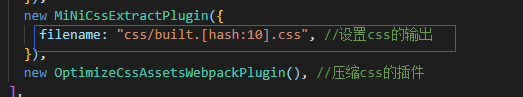
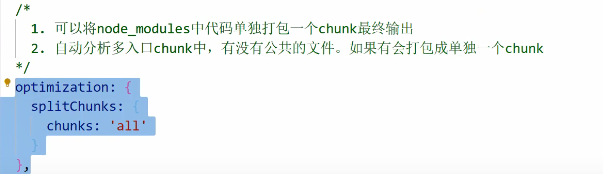

# webpack
https://blog.csdn.net/mus123/article/details/107711168
- 入口
- 输出
- module:
  - css
  - less
  - js兼容
  - js语法
  - css兼容
  - css压缩
  - 图片处理
  - 外部文件
- plugin
  - html
- 模式:production/development
- dev-server
## 1. css兼容性处理

```js
{
        test: /\.css$/,
        use: [
          // "style-loader",//代替style-loader不使用标签插入
          MiniCssExtractPlugin.loader,
          //css兼容性处理：postcss-loader postcss-preset-env
          "css-loader",
          // 'postcss-loader',//不能使用默认配置,帮postcss找到package.json中的browserslist（自己配置）
          // 而且browserslist默认是生产环境，要
          // "browserslist":{
          //设置node环境变量，process.env.NODE_ENV='development'
          //   "development":[
          //     "last 1 chrome version",
          //     "last 1 firefox version",
          //     "last 1 safari version"
          //   ],
          //生产环境:默认是生产环境
          //   "production":[
          //     ">0.01%",
          //     "not dead",
          //     "not op_mini all"
          //   ]
          // }
          {
            loader:'postcss-loader',
            options:{
              ident:'postcss',
              plugins:()=>[
                require("postcss-preset-env")()
              ]
            }
          }
        ],
      },
```
## 2.css压缩:optimize-css-assets-webpack-plugin
直接用
```js
plugins: [
    new HtmlWebpackPlugin({
      template: "./src/index.html",
    }),
    new MiniCssExtractPlugin({
      filename:'css/built.css'
    }),
    new OptimizeCssAssetsWebpackPlugin(),
  ],
```
## 3.js语法检查(先于babel执行,enforce:'pre')

```js
module:{
        rules:[
            {
                //语法检查：对js进行规范，检查语法错误，eslint-loader eslint
                //只检查源代码，不检查第三方
                //设置检查规则 package.json中的eslintConfig中设置（airbnb）
                // "eslintConfig":{
                //     "extends":"airbnb-base"
                //   }
                //eslint-config-airbnb-base(五react) eslint eslint-plugin-import
                test:/\.js$/,
                exclude:/node_modules/, //一定要排除第三方的检查
                loader:'eslint-loader',
                enforce:'pre' //优先执行
                options:{
                     fix:true,//自动修复
                },
            }
        ]
    }
```
设置检查规则 package.json中的eslintConfig中设置（airbnb）eslint-config-airbnb(-base)
```json
"eslintConfig":{
    "extends":"airbnb-base"
}
```
## 4.js的兼容性配置

```js
 module:{
        rules:[
            {
                //下载babel-loader和@babel/preset-env @babel/core
                loader:'babel-loader',
                test:/\.js$/,
                exclude:/node_modules/,
                options:{
                    //预设：指示babel做什么样的兼容性处理
                    presets:['@babel/preset-env']
                }
            }
        ]
    },
```
注：暂时只能转换基本语法，比如箭头函数是可以的，但是promise他又不认识了

因此要进行进一步兼容

使用@babel/polyfill引入所有的兼容语法


但是体积过大

所以推荐按需加载的方式core-js，删除之前引入的polyfill
```js
 module:{
        rules:[
            {
                //下载babel-loader和@babel/preset-env @babel/core
                //暂时只能转换一部分简单语法
                //使用@babel/polyfill，但是特别大
                //最终选择按需加载的方式 core-js
                loader:'babel-loader',
                test:/\.js$/,
                exclude:/node_modules/,
                options:{
                    //预设：指示babel做什么样的兼容性处理
                    //presets:['@babel/preset-env']
                    presets:[
                        [
                            '@babel/preset-env',{
                                useBuiltIns:'usage',//按需加载
                                corejs:{
                                    version:3,//制定core-js版本
                                },
                                targets:{
                                    chrome:"60",
                                    firefox:'60',
                                    ie:'9',
                                    safari:'10',
                                    edge:'17',
                                }
                            }
                        ]
                    ]
                }
            }
        ]
    },
```
## 5.js压缩
mode:'production'
## 6.html压缩(不需要做html兼容性处理)
```js
plugins: [
    new HtmlWebpackPlugin({
      template: "./src/index.html",
      minify:{
        //移除空格
        collapseWhitespace:true,
        //移除注释
        removeComments:true,
      }
    }),
  ],
```
----
# webpack 优化配置

- 开发环境
- 生产环境

## 开发环境
- 优化打包构建速度
  - 问题:只修改一个模块,但是其他模块也同样被打包,影响打包速度
  - 解决:HMR功能
  ```js
  devServer: {
    contentBase: path.resolve(__dirname, 'build'),
    compress: true,
    port: 3001,
    // 开启HRM热模块替换
    hot: true,
  },
  ```
  - **HRM热模块**替换：只会打包某一个模块而不是所有都重新打包

    - 样式文件在使用style-loader的情况下可以使用HRM

    - js文件默认不使用HRM，需要自动刷新：需要修改js文件实现热加载
    ```js
    if (module.hot) {
        //可以监听print.js的代码变化启动HRM，但是对入口文件index.js不能起到作用
        module.hot.accept('./print.js', () => {
        console.log('热加载print.');
        //console.log(module.hot);
        print();
    });
    }
    ```

    - html不能随之热加载，也不会自动刷新（修改entry入口，改成数组引入html），spa不做HRM(因为只有一个html文件) `entry: ['./src/js/index.js', './src/index.html'],`
  
- 优化代码调试
  - source-map:一种提供源代码与构建之后代码的映射技术
    - `devtool:'source-map'`
    - 有七种:
      - source-map：会生成built.js.map的一个映射文件

      - inline-source-map：内联，映射文件的代码会内嵌在构建后的built.js的末尾

      - hidden-source-map：会生成外部的built.js.map，但是在浏览器的source中会隐藏webpack://，不隐藏构建后代码

      - eval-source-map：也是内联的source-map，但是都会追加在built.js的每个模块引入的eval中

      - nosources-source-map：生成在外部，但是在浏览器的source中会隐藏我们的js源代码（有路径），构建后的js代码也看不见

      - cheap-source-map：生成在外部，和source-map类似但是错误提示到整行而不是整句，会受到babel的影响

      - cheap-module-source-map：生成在外部，和source-map类似但是错误提示到整行而不是整句，不会收到babel的影响
    - 
## 生产环境
- 优化打包构建速度
  - 问题:每个文件都会过一遍配置的loader,但是一个文件只能使用一个loader
  - 解决:oneOf:[...] ,将eslint loader 写在外边,与oneOf 同级
  - 问题:有100个js模块,只改了1个文件,那么其他99个文件也得重新构建一次
  - 解决:缓存
    - babel缓存
    - 
    - 文件资源缓存
    - 输出文件加上hash:但是如果重新打包,会导致所有缓存失败(只改了一个文件)
    - 解决办法:chunkhash:根据chunk生成的hash.如果打包来源于同一个chunk,那么hash值就一样:但是由于css与js同属一个chunk
    - 解决办法:contenthash:根据文件内容生成hash.不同文件的hash值一定不一样
    - 
    - 
- 优化代码运行性能
  - Tree shaking 树摇（去除没有使用的代码
      - 基本上生产环境下使用es6模块引用会自动使用
      - Tree shaking是为了去除无用的js或者css代码，减少代码体积
      - js：必须使用es6模块化，使用production环境
  - 代码分割
    - 多入口:输出文件[name]入口文件叫什么,输出文件就叫什么,但是这种编写方式不灵活
```js
   module.exports = {
  mode: "production", //生产模式
  // entry: "./src/js/index.js",//单入口
  entry:{
    //多入口，每个入口一个bundle
    main:'./src/js/index.js',
    test:'./src/js/test.js'
  },
  output: {
    filename: "js/[name].[contenthash:10].js",
    path: path.resolve(__dirname, "build"),
  },
  
  plugins: [
    new HtmlWebpackPlugin({
      template: "./src/index.html", //引用html模板
      minify:{//压缩html
          collapseInlineTagWhitespace:true,
          removeComments:true,
      }
    }),
  ],
  devtool:'source-map',
};
```
  - 使用splitChunks(多入口文件有没有共同的依赖)
  - 
  - 单独打包文件
```js
//index.js

// import { mul } from './test';
const add = (x, y) => x + y;
new Promise((resolve) => {
  console.log('promise');
  setTimeout(() => {
    console.log('timeout');
    resolve();
  }, 0);
}).then(() => {
  console.log('p_end');
});
console.log(add(2, 3));
import('./test')//返回promisr对象
  .then((res)=>{
    console.log('test加载成功',res)
    console.log(res.mul(3, 3));
  })
  .catch((e)=>{
    console.log(e)
  }
```
自定义名称
```js
import(/* webpackChunkName:'test' */'./test')//返回promisr对象
  .then((res)=>{
    console.log('test加载成功',res)
    console.log(res.mul(3, 3));
  })
  .catch((e)=>{
    console.log(e)
  })
```